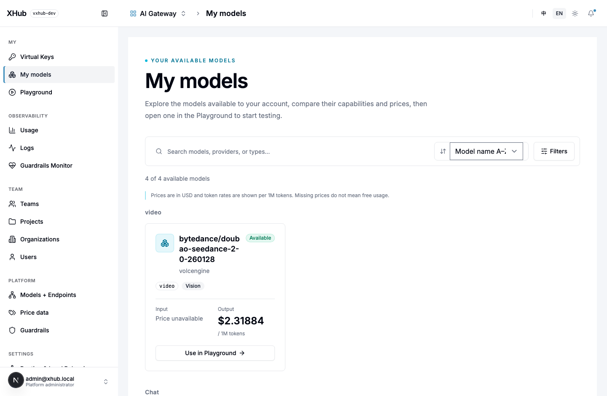
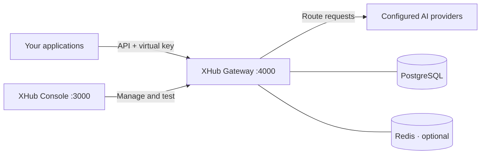
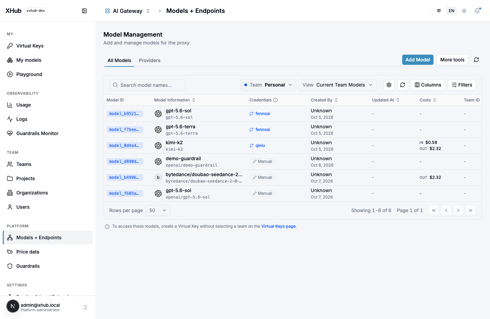

<div align="center">

# XHub

### Self-hosted AI gateway for teams

**One API for your models. One console for your team.**

Connect providers, control access, route requests, and understand AI usage on your own infrastructure.

[](go.mod)
[](frontend/package.json)
[](docker-compose.yml)
[](docs/getting-started.md)

**English** | [简体中文](README.zh-CN.md)

[Get started](#quick-start) · [Explore the console](#console-preview) · [Documentation](#documentation)

</div>

XHub brings model access and team administration into one self-hosted AI gateway. Applications use an OpenAI-compatible API; operators use a web console to manage providers, model deployments, virtual keys, routing, budgets, and usage.



## Why XHub?

Adding AI to a team means managing more than API calls: multiple providers, shared credentials, model permissions, and growing costs. XHub gives developers a consistent entry point and administrators a place to manage how it is used.

- **One integration, multiple providers.** Connect provider deployments behind public model names. Use the OpenAI SDK with your XHub URL and virtual key.
- **Access built around your team.** Organize resources into organizations, teams, and projects. Give people personal keys and applications shared service keys with scoped model access.
- **Routing you can control.** Choose deployments by weight, load, cost, latency, usage, or tags. Use weighted splits to distribute traffic and configure retries and timeouts.
- **Visibility into usage and cost.** Review usage by user, key, team, and project. Apply budgets and RPM/TPM limits, and inspect request logs and administrative audit events.
- **A console for everyday work.** Manage credentials and deployments, compare available models, and try them in the Playground. Both English and Chinese interfaces are available.

## What you can do

| Capability | What it gives you |
| --- | --- |
| Model and endpoint management | Configure upstream providers, credentials, public model names, and deployments |
| Virtual keys | Issue personal keys and team or project service keys; restrict available models |
| Team administration | Manage users, organizations, teams, projects, and scoped administrative permissions |
| Routing | Use deployment selection strategies, weighted traffic splits, retries, and timeouts |
| Usage controls | Configure budgets and key request/token rate limits |
| Usage and logs | Review token usage, calculated costs, request logs, and audit records |
| Chat guardrails | Block or redact configured words in supported chat text fields |
| Playground | Test models available to your account before integrating them into applications |

Provider adapters include OpenAI, Anthropic, and Gemini protocol families, alongside OpenAI-compatible endpoints. Qiniu and Volcengine also have provider-specific content-generation task forwarding. Supported operations depend on the configured provider and deployment.

## How it works



The Go gateway serves APIs; the Next.js console provides the interface. PostgreSQL stores configuration, identities, and usage. Redis is optional for shared runtime state when running from source; the Compose stack includes it.

## Console preview

**Discover models and try them.** Browse the models available to your account, review capabilities and prices, and launch the Playground from the model catalog shown above.

**Manage providers and deployments.** Keep upstream credentials and model endpoints together in one console.



*Screenshots show a configured local instance. A fresh installation starts without model deployments.*

## Quick start

**Prerequisites:** Go 1.25, Node.js ≥24.14.1, npm ≥11.10.0, and Docker with Compose. Use a fresh PostgreSQL database. See the [installation guide](docs/getting-started.md) for build requirements and setup details.

Build the services locally, then start the stack:

```bash
git clone https://github.com/sunqirui1987/xhub.git
cd xhub
bash deploy/build.sh
docker compose up -d
```

| Service | Local address |
| --- | --- |
| Web console | [localhost:3000/login](http://localhost:3000/login) |
| Gateway API | [localhost:4000](http://localhost:4000) |

For this local Compose setup, sign in with `admin@xhub.local` / `admin-pass-1234`. Change the password before exposing the instance.

Next, add a provider credential and model in **Models + Endpoints**, create an **organization and team**, add members, and issue a **virtual key** within the team scope. Test in the **Playground**, then follow the [user guide](docs/user-guide.md) for everyday administration.

## Make your first request

Install the client with `pip install openai`. Use your XHub virtual key and the public model name you configured:

```python
from openai import OpenAI

client = OpenAI(
    api_key="YOUR_XHUB_VIRTUAL_KEY",
    base_url="http://localhost:4000/v1",
)

response = client.chat.completions.create(
    model="YOUR_PUBLIC_MODEL_NAME",
    messages=[{"role": "user", "content": "Hello, XHub!"}],
)
print(response.choices[0].message.content)
```

SDK requests go to the **gateway on port 4000**. The console on port 3000 is for the web interface.

## Documentation

| Start here | What you will find |
| --- | --- |
| [Installation and running guide](docs/getting-started.md) | Docker, source development, first request, and deployment configuration |
| [User and administration guide](docs/user-guide.md) | Model setup, members, keys, routing, cost review, and troubleshooting |
| [Documentation index](docs/README.md) | Installation, customer workflows, and implementation references |
| [Developer and coding-agent guide](docs/development/README.md) | Code map, invariants, and checks for a change |
| [Testing](docs/development/testing.md) | Test layers, focused commands, and environment requirements |

Installation and customer guides are available in English and Chinese. Central development references are in Chinese; package-level `readme.md` / `readme_cn.md` files provide bilingual code guides.

## Project status

XHub is actively evolving. The [runtime reference](docs/development/runtime.md) describes current behavior and limits. Budgets check recorded spend and available hot spend without advance reservation. Provider-specific media task forwarding is available; a general asynchronous media lifecycle and a separate settlement ledger are not implemented.

## Contributing

Bug reports, documentation improvements, and pull requests are welcome. [Open an issue](https://github.com/sunqirui1987/xhub/issues) with reproduction steps or a concrete use case. For code changes, see the [development checks](docs/getting-started.md#development-and-verification) and relevant package guide.
