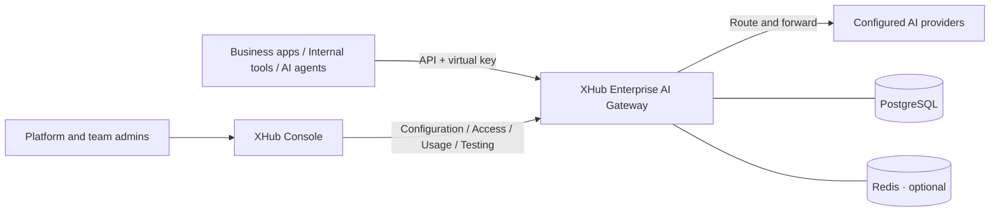

<div align="center">

# XHub

### A self-hosted AI gateway for enterprises

**Connect models. Govern enterprise AI. Power applications and agents.**

Give business applications, internal tools, and AI agents a shared model endpoint.
Manage models, access, cost, security, routing, and operations on your own infrastructure.

[](docs/getting-started.md)
[](#connect-your-applications)
[](go.mod)
[](docker-compose.yml)

**English** | [简体中文](README.zh-CN.md)

[Why XHub](#why-xhub) · [Enterprise AI capabilities](#enterprise-ai-capabilities-managed-together) · [Console preview](#console-preview) · [Docker installation](#docker-installation-and-usage) · [Documentation](#documentation)

</div>

XHub is an **enterprise AI access and governance platform** that brings model and protocol integration, organizational permissions, cost controls, security guardrails, routing, agent sessions, and media tasks into one gateway and console. Platform teams manage shared AI resources while business teams connect applications, test models, and track usage within their assigned permissions.

**Distinct XHub capabilities:** Compose enterprise pre-call checks in XGo, inherit routing templates through key/team/organization scopes, continue agent calls with Responses history, retain per-request price snapshots, and deduplicate settlement for supported asynchronous media tasks. Model catalogs, Playground, and call tracing connect these capabilities to everyday use.

[Website and online documentation](https://sunqirui1987.github.io/xhub/en/) · [Static website deployment](website/README.md)


## Why XHub?

As AI adoption grows from one application to multiple departments, model access needs a shared management layer.

| Enterprise challenge | How XHub helps |
| --- | --- |
| Each application integrates providers separately | Use an OpenAI-compatible API and public model names while the gateway manages upstream deployments |
| Shared provider keys make access hard to restrict or revoke | Issue personal and service virtual keys with model access scoped by team, project, and key |
| AI spend grows without clear ownership | Review usage and calculated costs by user, key, team, and project; configure budgets and rate limits |
| Failure handling and traffic allocation live in each application | Centralize deployment weights, routing strategies, retries, timeouts, and fallbacks |
| A few platform administrators handle every access request | Delegate organization and team responsibilities for members, projects, and service keys |
| Failed calls and configuration changes are difficult to trace | Use request logs, usage records, and administrative audit events for investigation |

## Enterprise AI capabilities, managed together

| Capability area | What XHub provides | Enterprise value |
| --- | --- | --- |
| Models and protocols | Provider credentials, model catalogs, multiple deployments, public model names, protocol adaptation, and native forwarding | A shared application endpoint and centralized model supply management |
| Organization and access | Organizations, teams, projects, scoped roles, personal and service keys, model permissions, and access revocation | Model access aligned with your organization and responsibilities |
| Cost and quotas | Usage dimensions, budgets, RPM/TPM, catalog and manual rates, cache pricing, time windows, and historical price snapshots | Cost ownership, reconciliation, and usage controls |
| Routing and reliability | Weighted splits, load/latency/cost/usage strategies, model groups, categorized fallbacks, retries, timeouts, and failure cooldowns | Deployment and request policies tailored to each business |
| Security and programmable guardrails | Keywords, regular expressions, secret detection, XGo scripts, external moderation adapters, blocking, redaction, and execution records | Business policies enforced in the request path |
| Agents and sessions | Chat, Responses, Messages, Gemini/Vertex dialogue endpoints, tool calls, history continuation, and session tracing | Support for business assistants, coding agents, and multi-turn tool workflows |
| Multimodal and media tasks | Deployment-specific image, audio, embedding, rerank, and video operations, with asynchronous result and usage tracking | Shared management for dialogue, retrieval, and content generation |
| Testing and operations | Model discovery, Playground, configuration diagnostics, request and error logs, audit records, and health checks | Provider validation, daily administration, and problem investigation |

### Model access: shared protocols and native capabilities

Manage provider credentials, deployments, public model names, and supported endpoints together. Dialogue endpoints cover OpenAI Chat/Responses, Anthropic Messages, and Gemini/Vertex, with conversion between supported dialogue structures and registered native forwarding paths. Applications use agreed model names while platform teams manage the deployments behind them.

Provider discovery and catalogs help administrators configure models and let business users inspect available models, capabilities, and prices. Available operations depend on the provider and deployment capabilities.

### Organization governance: platform control and team autonomy

Organize resources into organizations, teams, and projects, with platform, organization, and team administrators alongside ordinary members. Platform teams set model and budget boundaries; organization and team administrators manage members and projects within their scope. Members get their own model catalog and call records.

Give people personal keys and applications team or project service keys. Keys support model scopes, budgets, expiration, rotation, blocking, and deletion. Removing a member invalidates their personal keys for that team. Model permissions narrow through these scopes, with management and data access checked by the backend.

### Cost management: usage with traceable pricing

Review usage and calculated costs by user, key, team, and project. Configure budgets and RPM/TPM allocations on organization, team, user, and API Key pages. Pricing supports catalog and manual rates, input/output and cache read/write distinctions, token, picture, second, and query units, and peak/off-peak windows.

Each call retains its applied price snapshot, so later price changes preserve historical pricing evidence. Gateway response caching and provider prompt caching are recorded separately to support usage and cost reconciliation. Available measurement dimensions depend on the upstream data reported.

### Routing and reliability: policies for each business

Configure weighted traffic splits and deployment selection based on load, cost, latency, or usage through model settings and routing templates. Organize models into routing groups and define fallback chains for general errors, context limits, and upstream content-policy errors. Combine them with retries, timeouts, and failure cooldowns.

Organizations, teams, and keys can select or inherit routing templates. Session affinity and complete response caching for non-streaming calls are supported. Once streaming content has been sent, XHub does not switch providers and replay the response.

### Security guardrails: built-in rules and business customization

Apply keyword, RE2 regular-expression, secret-detection, and custom XGo checks to applicable Chat/Responses text. Rules can run by default or on demand, in priority order, with blocking, redaction, modification, or non-blocking flags and records of actual execution.

XGo guardrails can combine HTTP, JSON, and LLM calls for business checks. Implemented adapters connect OpenAI Moderation, Lakera, Azure, Bedrock, Presidio, and remote LiteLLM guardrails. The console supports draft testing, configuration validation, and rule management. The current execution stage is pre-call; see the [guardrail guide](docs/development/guardrails.md) for coverage.

### Agents and sessions: context and cost across turns

Handle multi-turn messages and tool-call structures in supported dialogue protocols. Continue Responses history through `previous_response_id` so subsequent turns can send incremental input. Associate sessions, call IDs, keys, and usage to trace consecutive requests from business assistants and coding agents.

The Playground supports streaming and non-streaming calls, session continuation, and complete curl examples to validate real requests and results before application integration.

### Multimodal and asynchronous tasks: a shared management layer

Connect image generation/editing, speech generation/transcription, embeddings, reranking, and other operations according to declared deployment capabilities and their implementations. Video task transports include Volcengine Ark, Qiniu Seedance, and registered Fal queues. Protocol, model, and pricing support depends on the deployment.

Supported asynchronous tasks can be created and queried, with links between the original request, terminal results, and usage. Logs show running, completed, or failed states; repeated completion queries deduplicate settlement. See the [runtime reference](docs/development/runtime.md) and [Qiniu Fal extension](docs/development/qiniu-fal.md) for provider-specific operations and pricing boundaries.

### Operations: from provider validation to investigation

Manage credentials, deployments, access, routing, guardrails, and usage through the English and Chinese console. Validate models and endpoints in the Playground, diagnose missing credentials or unavailable deployments, inspect request and error logs for failure stages, upstream responses, and pricing evidence, and review key administrative actions through audit records.

Self-host the Go gateway, web console, and data stores. Your organization manages the runtime environment and access policies. Health checks help investigate service and dependency state; model requests go to the provider endpoints you configure.

## From platform setup to business use

1. **Connect providers.** Add credentials and deployments, publish model names, and configure routing.
2. **Create organizations and teams.** Assign administrators, add members, and set team model access and budgets. Create projects as needed.
3. **Issue keys for people and applications.** Use personal keys for members and service keys for team or project applications.
4. **Validate in the Playground, then integrate.** Check available models and responses before connecting applications to the gateway API.
5. **Manage adoption over time.** Review usage and cost, adjust deployments and routing, revoke access, and investigate problems through logs.

## How it works



The gateway listens on `4000` and the console on `3000` by default. PostgreSQL stores configuration, identities, and usage. Redis provides shared runtime state; it is optional when running from source and included in the Compose stack.

## Console preview

**A model catalog for business teams.** The model page shown above displays the models available to the current account, their capabilities and prices, with access to Playground testing.

**A shared configuration workspace for platform teams.** Manage provider credentials, deployments, and public model names in Models + Endpoints.


*Screenshots show a configured local instance. A fresh installation starts without model deployments.*

## Enterprise use cases

| Use case | How to use XHub |
| --- | --- |
| Enterprise AI platform | Connect providers, publish a model catalog, and assign departmental and project access and budgets |
| Business applications and internal assistants | Give applications service keys and centrally manage model endpoints, routing, and cost ownership |
| Coding agents and multi-turn workflows | Connect supported dialogue protocols, handle tool calls and history continuation, and trace session usage |
| Knowledge retrieval and RAG | Manage dialogue, embedding, and rerank deployments with model access for retrieval workflows |
| Content and media production | Configure image, audio, and video models and inspect supported task results, status, and usage |
| Policy-sensitive AI access | Apply text guardrails and custom checks, restrict model scopes, and control access to logs |

Start with one team and one application, then expand along your organizational structure.

## Docker installation and usage

### 1. Prepare your environment

Install [Docker Desktop](https://docs.docker.com/desktop/) on macOS/Windows, or [Docker Engine](https://docs.docker.com/engine/install/) and the [Compose plugin](https://docs.docker.com/compose/install/linux/) on Linux. Start Docker and check:

```bash
docker version
docker compose version
```

The current deployment builds on your host and packages the output into Docker images. You also need **Git, Go 1.25, Node.js ≥24.14.1, npm ≥11.10.0**, and a readable `/etc/ssl/cert.pem`. The build script requires Bash; on Windows, install these tools inside WSL2 Linux and enable Docker Desktop WSL integration. The script supports amd64/arm64 and downloads Linux Node.js from npmmirror. See the [installation guide](docs/getting-started.md) for complete requirements.

### 2. Build and start

```bash
git clone https://github.com/sunqirui1987/xhub.git
cd xhub
bash deploy/build.sh
docker compose up -d --no-build
docker compose ps
```

The build script creates local `xhub-gateway` and `xhub-console` images. Compose starts the gateway, console, PostgreSQL, and Redis. PostgreSQL data is stored in the `xhub-pg` named volume. Use a fresh database for your first installation.

| Service | Purpose and address |
| --- | --- |
| Web console | [http://localhost:3000/login](http://localhost:3000/login) for models, teams, and policies |
| Gateway API | [http://localhost:4000](http://localhost:4000) for SDKs, applications, and agents |
| PostgreSQL | Host port `5433` for configuration, identity, and usage storage |
| Redis | Internal Compose service for shared runtime state |

### 3. Sign in and connect your first model

The initial local administrator is `admin@xhub.local` / `admin-pass-1234`. Change the password after signing in, then:

1. Add provider credentials, a deployment, and a public model name in **Models + Endpoints**.
2. Create an organization and team, set model access and budgets, and add members. Create projects as needed.
3. Issue personal keys for members and service keys for applications.
4. Test in the Playground, then connect applications using the gateway URL and virtual keys.

A fresh installation starts without model deployments. Follow the [user and administration guide](docs/user-guide.md) for complete steps.

### 4. Operate and update

```bash
# Follow gateway and console logs
docker compose logs -f gateway console

# Restart application services
docker compose restart gateway console

# Stop services and retain the PostgreSQL volume
docker compose down

# Start again
docker compose up -d --no-build
```

Back up your database before updating. From the repository directory, pull the new version, rebuild, and recreate the application containers:

```bash
git pull --ff-only
bash deploy/build.sh
docker compose up -d --no-build --force-recreate gateway console
```

For a server deployment, set `NEXT_PUBLIC_BASE_URL` to the browser-accessible gateway URL before building, and set Compose's `XHUB_PUBLIC_ORIGIN` to the same public API URL. Keep the console container's `XHUB_GATEWAY_ORIGIN` set to a reachable internal gateway address. Gateway settings, including initial administrator credentials, are in `configs/config.docker.yaml`; rebuild images after changing them. Initial password configuration only creates accounts that do not exist; change an existing account's password in the console. See [deployment configuration](docs/getting-started.md#deployment-configuration) for details.

## Run from source

For local development or independently managed PostgreSQL/Redis, follow the [source installation guide](docs/getting-started.md#run-from-source) to start the Go gateway and Next.js console separately. The gateway and console still use ports `4000` and `3000`; applications connect the same way.

## Connect your applications

Install the client with `pip install openai`. Use your XHub virtual key and the public model name you configured:

```python
from openai import OpenAI

client = OpenAI(
    api_key="YOUR_XHUB_VIRTUAL_KEY",
    base_url="http://localhost:4000/v1",
)

response = client.chat.completions.create(
    model="YOUR_PUBLIC_MODEL_NAME",
    messages=[{"role": "user", "content": "Hello, XHub!"}],
)
print(response.choices[0].message.content)
```

SDK requests go to the **gateway on port 4000**; port 3000 serves the web console. Check the configured deployment's capabilities before integrating other operations.

## Documentation

| Guide | What it covers |
| --- | --- |
| [Installation and running guide](docs/getting-started.md) | Docker, source setup, first request, and deployment configuration |
| [User and administration guide](docs/user-guide.md) | Model setup, members and keys, routing, cost review, and troubleshooting |
| [Permission rules](docs/development/permissions.md) | Platform, organization, team, and member access scopes |
| [Runtime behavior and limits](docs/development/runtime.md) | Budgets, protocols, cache, idempotency, and multiple gateway instances |
| [Documentation index](docs/README.md) | User guides and implementation references |
| [Developer and coding-agent guide](docs/development/README.md) | Code map, invariants, and checks for a change |
| [Testing](docs/development/testing.md) | Unit tests, backend regression, and browser E2E |

Installation and customer guides are available in English and Chinese. Central development references are in Chinese; package-level `readme.md` / `readme_cn.md` files provide bilingual code guides.

## Project status and deployment references

XHub is actively evolving. Evaluate production requirements against the [runtime reference](docs/development/runtime.md), [permission rules](docs/development/permissions.md), and [guardrail guide](docs/development/guardrails.md). Budgets do not reserve request costs; shared limits, caching, and idempotency have implementation boundaries across instances. Reconcile calculated costs with provider bills. Account login and scoped roles currently exclude SSO/SCIM; this repository does not promise commercial SLAs or compliance certifications.

## Contributing

XHub is actively evolving. [Open an issue](https://github.com/sunqirui1987/xhub/issues) with an enterprise use case or reproduction steps, improve the documentation, or submit a pull request. For code changes, follow the [developer guide](docs/development/README.md) and the relevant module's validation requirements.

### Hierarchical quota allocation

Budgets follow **Organization → Team → Person → API Key**, in USD. Each person belongs to at most one team. Fixed child budgets reserve their unused amounts; sibling allocations and consumed money must fit within the parent budget. Blank budgets share the parent's unreserved balance; zero blocks spending. An organization budget of $1,000 can allocate $500 + $300 + $200 across teams, but cannot allocate another dollar. Personal keys without an explicit team binding still bill the owner's sole team. Service keys bill a separate business account. Use a separate unlimited organization and team for unrestricted business usage.

RPM and TPM follow the same hierarchy: team allocations sum within the organization, personal allocations within the team, and key allocations within the person. Fixed values reserve minute capacity; blank values share the unreserved remainder; zero blocks calls. Blank intermediates pass fixed descendant allocations upward. Over-allocation rolls back the save. Admission atomically counts the unique ownership path and rejected calls consume no rate capacity. TPM uses the incoming token estimate; windows are UTC calendar minutes. Multiple gateway instances need shared Redis.

See [quota management](docs/quota-management.md) for examples, administrator permissions, membership changes, historical spending, and the request-admission/settlement boundary.
For code ownership, allocation invariants, admission and accounting flow, and layered test commands, see [quota implementation and verification](docs/development/quota-chain.md).
Quota acceptance uses fresh temporary ownership chains for each budget and RPM/TPM check, verifies rejection before any upstream call and successful billed recovery, then deletes all temporary resources. Existing allocations and spending remain intact. The actual acceptance script is covered by a local gateway/database regression test; see [acceptance dataset documentation](docs/testdata/real-acceptance/README.md).
