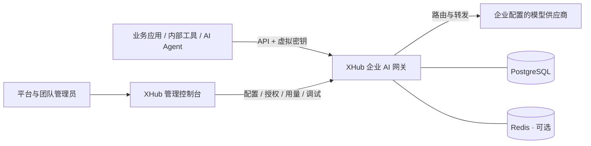

<div align="center">

# XHub

### 面向企业的自托管 AI 网关

**统一接入模型，治理企业 AI，连接应用与 Agent。**

为业务应用、内部工具和 AI Agent 提供统一模型入口，
让平台团队在自己的基础设施上统一管理模型、权限、成本、安全、路由与运行状态。

[](docs/getting-started.zh-CN.md)
[](#接入你的应用)
[](go.mod)
[](docker-compose.yml)

[English](README.md) | **简体中文**

[为什么选择 XHub](#为什么选择-xhub) · [企业 AI 能力](#企业-ai-能力一处管理) · [控制台预览](#控制台预览) · [Docker 安装](#docker-安装与使用) · [文档](#文档)

</div>

XHub 面向企业建设统一的 **AI 接入与治理平台**，将多模型与多协议接入、组织权限、成本控制、安全护栏、请求路由、Agent 会话和媒体任务整合在同一网关与控制台中。平台团队集中管理 AI 资源，各业务团队在授权范围内接入应用、调试模型并追踪使用情况。

**XHub 的特色：** 用 XGo 编排企业调用前检查；让路由模板沿密钥、团队、组织继承；用 Responses 历史续接支持 Agent 连续调用；保留每次请求的价格快照，并对支持的异步媒体任务去重结算。模型目录、Playground 与调用追踪把这些能力连接到日常使用中。

[官网与在线文档](https://sunqirui1987.github.io/xhub/) · [静态站点部署指南](website/README.md)


## 为什么选择 XHub？

从一个应用调用模型，到多个部门共同使用 AI，接入方式也需要随之升级。

| 企业面临的问题 | XHub 提供的管理方式 |
| --- | --- |
| 各应用分别对接供应商，更换模型需要重复集成 | 通过 OpenAI 兼容 API 和统一公开模型名接入，由网关管理上游部署 |
| 多人共用供应商密钥，难以限定权限和回收访问 | 为个人与应用分配虚拟密钥，按团队、项目和密钥限定模型范围 |
| AI 支出不断增长，却难以定位到使用者和业务 | 按用户、密钥、团队和项目查看用量与计算费用，配置预算与速率限制 |
| 上游故障与流量分配逻辑散落在各个应用中 | 在网关集中配置部署权重、路由策略、重试、超时和回退 |
| 模型配置与权限都依赖少数平台管理员 | 分配平台、组织和团队管理职责，让团队处理各自的成员、项目和服务密钥 |
| 调用失败或配置变更后，缺少统一排查入口 | 结合调用日志、用量记录和管理审计，追踪请求与管理操作 |

## 企业 AI 能力，一处管理

| 能力领域 | XHub 提供什么 | 为企业解决什么 |
| --- | --- | --- |
| 模型与协议接入 | 供应商凭证、模型目录、多部署、公开模型名、协议适配与原生转发 | 为不同应用提供统一入口，集中管理模型供应链 |
| 组织与访问治理 | 组织、团队、项目、分级角色、个人密钥、服务密钥、模型权限与访问回收 | 将模型使用纳入企业组织和权限体系 |
| 成本与额度管理 | 多维用量、预算、RPM/TPM、目录与人工费率、缓存计价、时段价格、历史价格快照 | 明确费用归属，支持成本核对与使用控制 |
| 路由与运行可靠性 | 加权分流、负载/延迟/费用/用量策略、路由组、分类回退、重试、超时与失败冷却 | 让不同业务使用适合自己的部署与请求策略 |
| 安全与可编程护栏 | 关键词/正则、密钥检测、XGo 脚本、外部审核适配、拦截、脱敏与执行记录 | 将企业规则放进真实调用链，并支持业务定制 |
| Agent 与会话管理 | Chat、Responses、Messages、Gemini/Vertex 对话入口，工具调用、历史续接与会话追踪 | 支持业务助手、编码 Agent 和多轮工具调用应用 |
| 多模态与媒体任务 | 按部署能力接入图片、音频、Embedding、Rerank 与视频任务，追踪异步结果和用量 | 将对话、检索与内容生成纳入同一管理体系 |
| 调试与运行管理 | 模型发现、Playground、模型对比、配置诊断、调用日志、错误日志、审计与健康检查 | 覆盖接入验证、日常管理与故障定位 |

### 模型接入：兼顾统一协议与原生能力

集中管理供应商凭证、模型部署、公开模型名与支持的端点。对话入口覆盖 OpenAI Chat/Responses、Anthropic Messages、Gemini/Vertex，可在受支持的对话结构间转换，也可选择已登记的原生协议转发。应用通过约定的模型名调用，平台团队在网关管理其背后的部署。

模型发现与目录展示帮助管理员配置供应商模型，也让业务成员查看自己可用的模型、能力与价格。具体可用操作以供应商和部署支持的能力为准。

### 组织治理：从平台管理到团队自治

以组织、团队和项目管理资源，区分平台管理员、组织管理员、团队管理员与普通成员。平台团队设置模型与预算边界，组织和团队管理员在授权范围内管理成员与项目，业务成员使用自己的模型目录和调用记录。

个人使用个人密钥，应用使用团队或项目服务密钥。密钥支持模型范围、预算、有效期、轮换、停用和删除；成员移出团队后，其对应的个人密钥失效。模型权限逐层收窄，管理操作与数据访问由后台校验。

### 成本管理：从 Token 统计到可追溯计价

按用户、密钥、团队和项目查看用量与计算费用，设置预算及密钥 RPM/TPM 限额。费率支持目录定价与人工配置，可区分输入输出、缓存读写，以及 Token、图片、秒数和查询次数等计价维度，并支持高峰与非高峰时段价格。

每次调用保留实际应用的价格快照，配置改价后仍可追踪历史计价依据。网关完整响应缓存与供应商提示词缓存分别记录，帮助核对不同缓存机制下的用量与费用。可用计量维度取决于上游实际返回的数据。

### 路由与可靠性：按业务选择执行策略

在模型部署与路由模板中配置加权分流，以及按负载、费用、延迟或用量选择部署的策略。通过路由组组织模型资源，为通用错误、上下文超限和供应商内容策略错误配置回退链，结合重试、超时与失败冷却处理上游变化。

组织、团队和密钥可以选择或继承路由模板。支持会话粘性与非流式完整响应缓存；流式内容开始输出后，不会重新切换供应商并重放响应。

### 安全护栏：从内置规则到业务定制

对适用的 Chat/Responses 文本执行关键词、RE2 正则、密钥特征检测与 XGo 自定义脚本。规则可以默认启用或按需调用，按优先级执行拦截、脱敏、修改或非阻断标记，并记录实际执行结果。

XGo 护栏可使用 HTTP、JSON 和 LLM 调用组合业务检查。已有适配器可连接 OpenAI Moderation、Lakera、Azure、Bedrock、Presidio，以及远端 LiteLLM 护栏。控制台支持草稿调试、配置校验与规则管理；当前执行阶段为调用前检查，覆盖范围见[护栏指南](docs/development/guardrails.md)。

### Agent 与会话：管理连续调用的上下文与费用

支持受支持对话协议中的多轮消息与工具调用结构，使用 Responses 的 `previous_response_id` 续接历史，让应用在后续轮次发送新增输入。将会话、调用 ID、密钥与用量关联，用于追踪业务助手和编码 Agent 的连续请求。

Playground 支持流式与非流式调用、会话续接和模型对比，帮助开发者在业务集成前验证实际请求与结果。

### 多模态与异步任务：纳入同一模型管理体系

按部署声明和实现能力接入图片生成/编辑、语音生成/转写、Embedding、Rerank 等操作；视频任务提供火山方舟、七牛 Seedance 与已登记 Fal 队列传输。具体协议、模型和计价支持范围以部署为准。

支持的异步任务可创建并查询状态，关联原始请求、终态结果与用量；日志可展示执行中、完成或失败状态，重复完成查询执行结算去重。各供应商的任务操作与计价边界见[运行参考](docs/development/runtime.md)及[七牛 Fal 扩展](docs/development/qiniu-fal.md)。

### 运行管理：从接入验证到问题定位

在中英文控制台中完成凭证、部署、权限、路由、护栏与用量管理。通过 Playground 验证模型和端点，通过配置诊断发现缺失凭证或不可用部署，通过调用与错误日志追踪失败阶段、上游响应和价格依据，通过管理审计查看关键操作。

自托管 Go 网关、Web 控制台与数据存储，由企业管理运行环境和访问策略。健康检查帮助定位服务与依赖状态；模型请求由网关发送到企业配置的供应商端点。

## 从平台接入到业务使用

1. **平台团队接入供应商。** 添加凭证与部署，发布业务可用的模型名称，设置路由。
2. **按业务建立组织与团队。** 指定管理员、添加成员，配置团队模型范围与预算；项目按需创建。
3. **为人和应用分配密钥。** 个人密钥用于成员调用，服务密钥用于团队或项目应用。
4. **先在 Playground 验证，再接入业务。** 确认可用模型与请求结果，通过网关 API 集成应用。
5. **持续管理与追踪。** 查看用量和费用，调整部署与路由，回收访问权限，结合日志排查问题。

## 工作方式



网关默认监听 `4000`，控制台默认监听 `3000`。PostgreSQL 保存配置、身份与用量；Redis 用于共享运行状态，源码运行时可按需启用，Compose 部署包含 Redis。

## 控制台预览

**给业务团队一个可用的模型目录。** 在上方模型页面查看当前账号可访问的模型、能力与价格，进入 Playground 测试。

**给平台团队一个统一的配置入口。** 在模型与端点页面管理供应商凭证、部署和公开模型名。


*截图来自已配置的本地实例。全新安装默认没有模型部署。*

## 企业使用场景

| 场景 | 如何使用 XHub |
| --- | --- |
| 企业 AI 平台 | 统一接入供应商，发布模型目录，按部门与项目分配访问和预算 |
| 业务应用与内部助手 | 为每个应用配置服务密钥，集中管理模型入口、路由与费用归属 |
| 编码 Agent 与多轮工作流 | 接入支持的对话协议，处理工具调用与历史续接，追踪会话用量 |
| 知识检索与 RAG | 管理对话、Embedding 与 Rerank 部署，为检索链路分配模型权限 |
| 内容与媒体生产 | 集中配置图片、音频与视频模型，查看支持任务的结果、状态与用量 |
| 安全敏感的 AI 接入 | 配置文本护栏与自定义检查，限制模型范围，按访问权限查看日志 |

从一个团队、一个应用开始试点，再沿企业组织结构扩展到更多业务。

## Docker 安装与使用

### 1. 准备环境

安装 [Docker Desktop](https://docs.docker.com/desktop/)（macOS/Windows），或 [Docker Engine](https://docs.docker.com/engine/install/) 与 [Compose 插件](https://docs.docker.com/compose/install/linux/)（Linux），启动 Docker 后检查：

```bash
docker version
docker compose version
```

当前部署方式是在主机上构建，再打包为 Docker 镜像，因此还需要 **Git、Go 1.25、Node.js ≥24.14.1、npm ≥11.10.0**，以及可读取的 `/etc/ssl/cert.pem`。构建脚本需要 Bash 环境；Windows 用户请在 WSL2 Linux 环境中安装上述工具并启用 Docker Desktop 的 WSL 集成。脚本支持 amd64/arm64，从 npmmirror 下载 Linux Node.js；完整要求见[安装指南](docs/getting-started.zh-CN.md)。

### 2. 构建并启动

```bash
git clone https://github.com/sunqirui1987/xhub.git
cd xhub
bash deploy/build.sh
docker compose up -d --no-build
docker compose ps
```

构建脚本生成本地 `xhub-gateway` 与 `xhub-console` 镜像。Compose 启动网关、控制台、PostgreSQL 和 Redis；PostgreSQL 数据保存在 `xhub-pg` 命名卷中。初次部署使用全新的数据库。

| 服务 | 用途与地址 |
| --- | --- |
| Web 控制台 | [http://localhost:3000/login](http://localhost:3000/login)，管理模型、团队与策略 |
| 网关 API | [http://localhost:4000](http://localhost:4000)，供 SDK、应用与 Agent 连接 |
| PostgreSQL | 主机端口 `5433`，保存配置、身份与用量 |
| Redis | Compose 内部服务，共享运行状态 |

### 3. 登录并接入第一个模型

本地初始管理员为 `admin@xhub.local` / `admin-pass-1234`。登录后修改密码，再完成以下配置：

1. 在**模型与端点（Models + Endpoints）**添加供应商凭证、模型部署和公开模型名。
2. 创建组织与团队，设置模型范围与预算，添加成员；项目按需创建。
3. 为成员创建个人密钥，为应用创建服务密钥。
4. 在 Playground 验证模型，再使用网关地址与虚拟密钥接入应用。

新安装默认没有模型部署。完整操作见[客户使用与管理手册](docs/user-guide.zh-CN.md)。

### 4. 日常使用与更新

```bash
# 查看网关和控制台日志
docker compose logs -f gateway console

# 重启应用服务
docker compose restart gateway console

# 停止服务，保留 PostgreSQL 数据卷
docker compose down

# 再次启动
docker compose up -d --no-build
```

更新前备份数据库，在仓库目录拉取新版本、重新构建并重建应用容器：

```bash
git pull --ff-only
bash deploy/build.sh
docker compose up -d --no-build --force-recreate gateway console
```

企业服务器部署时，在构建前设置 `NEXT_PUBLIC_BASE_URL` 为浏览器可访问的网关地址，并将 Compose 中的 `XHUB_PUBLIC_ORIGIN` 设置为同一公开 API 地址；控制台容器的 `XHUB_GATEWAY_ORIGIN` 保持为可访问网关的内部地址。初始化管理员等网关配置位于 `configs/config.docker.yaml`，修改后需重新构建镜像。初始密码配置只用于创建尚不存在的账号，已有账号通过控制台修改密码。详细配置见[部署配置](docs/getting-started.zh-CN.md#部署配置)。

## 从源码运行

需要本地开发或自行管理 PostgreSQL/Redis 时，可按[源码运行指南](docs/getting-started.zh-CN.md#从源码运行)分别启动 Go 网关与 Next.js 控制台。网关与控制台仍分别使用 `4000`、`3000` 端口；应用接入方式相同。

## 接入你的应用

通过 `pip install openai` 安装客户端，使用 XHub 虚拟密钥与已配置的公开模型名：

```python
from openai import OpenAI

client = OpenAI(
    api_key="YOUR_XHUB_VIRTUAL_KEY",
    base_url="http://localhost:4000/v1",
)

response = client.chat.completions.create(
    model="YOUR_PUBLIC_MODEL_NAME",
    messages=[{"role": "user", "content": "Hello, XHub!"}],
)
print(response.choices[0].message.content)
```

SDK 连接 **4000 端口的网关**；3000 端口提供 Web 控制台。集成其他操作前，请核对对应部署的支持能力。

## 文档

| 入口 | 内容 |
| --- | --- |
| [安装与运行指南](docs/getting-started.zh-CN.md) | Docker、源码运行、首次调用与部署配置 |
| [客户使用与管理手册](docs/user-guide.zh-CN.md) | 模型接入、成员与密钥、路由、费用及排障 |
| [权限规则](docs/development/permissions.md) | 平台、组织、团队和成员的权限与可见范围 |
| [运行行为与限制](docs/development/runtime.md) | 预算、协议、缓存、幂等与多实例部署边界 |
| [文档索引](docs/README.zh-CN.md) | 使用指南与实现参考 |
| [开发与 AI 编程指南](docs/development/README.md) | 代码导航、关键约束及修改验证 |
| [测试指南](docs/development/testing.md) | 单元测试、后台回归与浏览器 E2E |

安装和客户手册提供中英文版本。集中开发参考使用中文，各模块的 `readme.md` / `readme_cn.md` 提供双语代码说明。

## 项目状态与部署参考

XHub 正在持续迭代。生产选型请结合[运行行为参考](docs/development/runtime.md)、[权限规则](docs/development/permissions.md)与[护栏指南](docs/development/guardrails.md)核对所需能力。预算没有请求费用预占，多实例的共享限额、缓存与幂等存在实现边界；实际费用需与供应商账单核对。当前账号登录与分级权限不包含 SSO/SCIM，本仓库不承诺商业 SLA 或合规认证。

## 参与贡献

XHub 正在持续迭代。欢迎带着企业使用场景[提交 Issue](https://github.com/sunqirui1987/xhub/issues)、改进文档或发起 Pull Request。修改代码前，请参考[开发指南](docs/development/README.md)与对应模块的验证要求。
