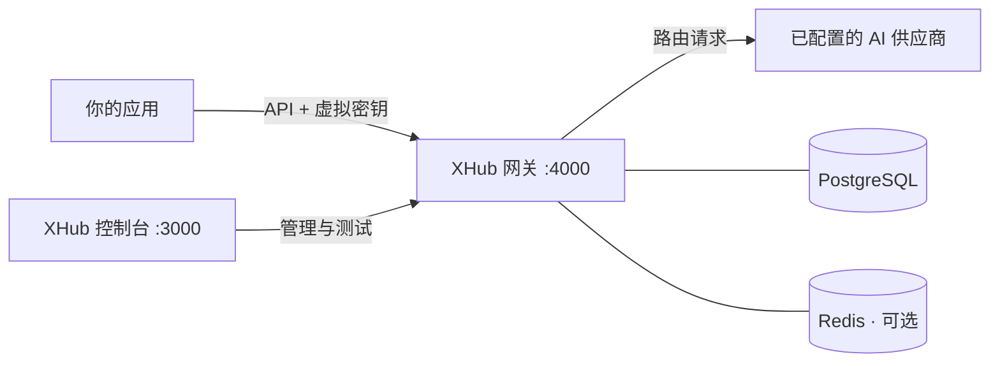

<div align="center">

# XHub

### 面向团队的自托管 AI 网关

**一个 API 接入模型，一个控制台管理团队。**

在自己的基础设施上，统一管理供应商、访问权限、请求路由与 AI 用量。

[](go.mod)
[](frontend/package.json)
[](docker-compose.yml)
[](docs/getting-started.zh-CN.md)

[English](README.md) | **简体中文**

[快速开始](#快速开始) · [控制台预览](#控制台预览) · [文档](#文档)

</div>

XHub 把模型接入和团队管理集中到一个自托管 AI 网关中。应用通过 OpenAI 兼容 API 调用模型；管理员通过 Web 控制台管理供应商、模型部署、虚拟密钥、路由、预算与用量。


## 为什么选择 XHub？

团队使用 AI，需要处理的不只是 API 调用：多个供应商、共享凭证、模型权限，以及不断增长的费用。XHub 为开发者提供统一入口，也为管理员提供管理这些资源的工作台。

- **一次集成，接入多个供应商。** 将上游部署放在统一的公开模型名后面。用 OpenAI SDK 配置 XHub 地址和虚拟密钥，即可开始调用。
- **按团队分配访问权限。** 以组织、团队、项目管理资源。为个人创建个人密钥，为应用创建共享服务密钥，并限定可用模型范围。
- **让路由按需求运行。** 按权重、负载、费用、延迟、用量或标签选择部署；通过加权分流分配流量，配置重试与超时。
- **看清用量与费用。** 按用户、密钥、团队和项目查看用量，设置预算与 RPM/TPM 限额，检查调用日志与管理审计记录。
- **在控制台完成日常工作。** 管理凭证和部署、比较可用模型，并在 Playground 中试用。界面支持英文和中文切换。

## 核心能力

| 能力 | 可以做什么 |
| --- | --- |
| 模型与端点管理 | 配置上游供应商、凭证、公开模型名与部署 |
| 虚拟密钥 | 创建个人密钥、团队或项目服务密钥，限定可用模型 |
| 团队管理 | 管理用户、组织、团队、项目及成员，分配不同范围的管理权限 |
| 请求路由 | 配置部署选择策略、加权分流、重试与超时 |
| 用量控制 | 设置预算及密钥的请求数、Token 速率限制 |
| 用量与日志 | 查看 Token 用量、计算费用、调用日志与审计记录 |
| 聊天护栏 | 对支持的聊天文本字段进行关键词拦截或脱敏 |
| Playground | 先试用当前账号可访问的模型，再集成到应用 |

供应商适配包含 OpenAI、Anthropic、Gemini 协议族及 OpenAI 兼容端点，同时提供七牛与火山引擎的内容生成任务专用转发。具体可用操作取决于供应商与部署配置。

## 工作方式



Go 网关提供 API，Next.js 控制台提供界面。PostgreSQL 保存配置、身份与用量数据。源码运行时，Redis 可按需启用，用于共享运行状态；Compose 部署包含 Redis。

## 控制台预览

**发现模型，直接试用。** 在上方模型目录中浏览当前账号可用的模型、查看能力和价格，并进入 Playground 测试。

**集中管理供应商与部署。** 在同一个控制台中管理上游凭证和模型端点。


*截图来自已配置的本地实例。全新安装默认没有模型部署。*

## 快速开始

**准备环境：** Go 1.25、Node.js ≥24.14.1、npm ≥11.10.0，以及支持 Compose 的 Docker。使用全新的 PostgreSQL 数据库。构建要求和完整配置见[安装指南](docs/getting-started.zh-CN.md)。

先在本机构建，再启动服务：

```bash
git clone https://github.com/sunqirui1987/xhub.git
cd xhub
bash deploy/build.sh
docker compose up -d
```

| 服务 | 本地地址 |
| --- | --- |
| Web 控制台 | [localhost:3000/login](http://localhost:3000/login) |
| 网关 API | [localhost:4000](http://localhost:4000) |

此本地 Compose 配置的初始管理员为 `admin@xhub.local` / `admin-pass-1234`。对外开放前请修改密码。

接下来，在 **Models + Endpoints** 中添加供应商凭证和模型，创建**组织与团队**、添加成员，再创建团队范围内的**虚拟密钥**。在 **Playground** 测试后，按[客户手册](docs/user-guide.zh-CN.md)完成日常管理。

## 发起第一次调用

通过 `pip install openai` 安装客户端，使用你的 XHub 虚拟密钥和已配置的公开模型名：

```python
from openai import OpenAI

client = OpenAI(
    api_key="YOUR_XHUB_VIRTUAL_KEY",
    base_url="http://localhost:4000/v1",
)

response = client.chat.completions.create(
    model="YOUR_PUBLIC_MODEL_NAME",
    messages=[{"role": "user", "content": "Hello, XHub!"}],
)
print(response.choices[0].message.content)
```

SDK 请求发送到 **4000 端口的网关**。3000 端口提供 Web 控制台。

## 文档

| 入口 | 内容 |
| --- | --- |
| [安装与运行指南](docs/getting-started.zh-CN.md) | Docker、源码开发、首次调用与部署配置 |
| [客户使用与管理手册](docs/user-guide.zh-CN.md) | 模型配置、成员与密钥管理、路由、费用核对及排障 |
| [文档索引](docs/README.zh-CN.md) | 安装、客户操作及实现参考 |
| [开发与 AI 编程指南](docs/development/README.md) | 代码导航、关键约束及修改验证 |
| [测试指南](docs/development/testing.md) | 测试层次、定向验证命令及环境要求 |

安装和客户手册提供英文与中文版本。集中开发参考使用中文，各模块的 `readme.md` / `readme_cn.md` 提供双语代码说明。

## 项目状态

XHub 正在持续迭代。[运行行为参考](docs/development/runtime.md)说明当前实现与限制。预算检查已记录的支出和可用热状态支出，不提前预占费用。供应商专用媒体任务转发已实现，通用异步媒体生命周期及独立结算账本尚未实现。

## 参与贡献

欢迎提交问题、改进文档或发起 Pull Request。[提交 Issue](https://github.com/sunqirui1987/xhub/issues) 时，请提供复现步骤或具体使用场景。修改代码前，可参考[开发验证说明](docs/getting-started.zh-CN.md#开发与验证)及相关模块文档。
