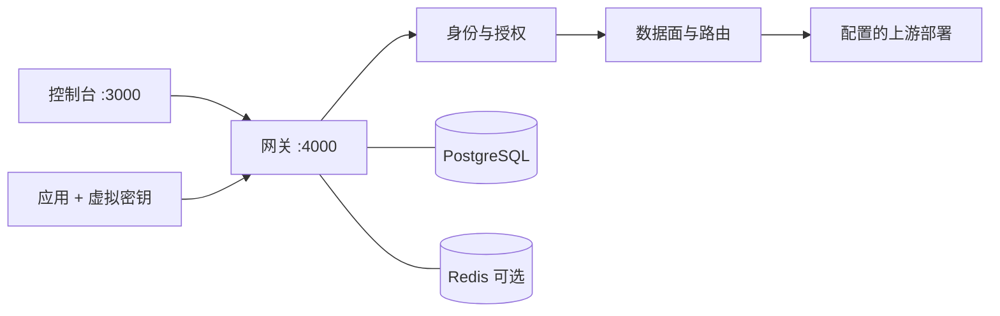

# 架构与代码导航

[开发指南](README.md) · [权限](permissions.md) · [路由](routing.md) · [计价](pricing.md)

## 两个服务

Go 网关提供 API，默认 `:4000`；Next.js 控制台提供网页，默认 `:3000`。SDK 请求发送给网关。网关不托管控制台 HTML。PostgreSQL 保存身份、配置和用量；Redis 可选，用于运行状态、速率计数、粘性及用量队列。

## 一次调用

1. `gateway.Handler` 处理调用 ID、访问日志、CORS 和请求正文。有幂等键的非流式请求先进入已认证的进程内协调与回放。
2. 登记的官方转发路径在 Gin 之前匹配，进入 `dataplane.ServeBypass`；其它路径由已安装模块或目录入口处理。未登记路径返回 JSON 404。
3. 普通推理进入 `dataplane.Serve`，重新鉴权并检查模型范围、预算和速率限制；支持的聊天文本执行护栏，正文重新序列化。
4. 解析当前路由模板、可用部署、会话粘性和缓存范围。非流式响应缓存命中返回原结果并记零新增费用。
5. 过滤暂停和能力不符部署，按策略选路。每次上游尝试前再检查身份和限制。适配请求经 `llm.Build` 构造；发送、重试和流处理由数据面承担。
6. 记录响应、usage、部署和调用元数据。仅完整成功更新粘性与缓存；流已输出后中断不能换上游续写。
7. `gateway.RecordSpend` 计算费用与快照，直接写 PostgreSQL 或进入 Redis 队列。队列刷写先提交事务，再确认消费。

官方任务的创建、查询和结算走专门路径，不能套用普通聊天的缓存、护栏或重试保证。详见[运行行为](runtime.md)。

## 模块责任

| 模块 | 负责 | 边界 |
| --- | --- | --- |
| [gateway](../../internal/gateway/readme.md) | HTTP 入口、路由安装、各 Host 接口接线 | 子模块通过接口调用，不反向导入 gateway |
| [auth](../../internal/auth/auth.go) | 解析凭据、建立调用身份 | 不决定团队管理权限 |
| [authz](../../internal/authz/decide.go) | 动作授权、当前成员关系、查询范围 | 不依赖前端角色判断 |
| [iam](../../internal/iam/readme.md) | 身份、模板、usage、日志与审计持久化 | 接收授权后的查询条件，不自行定义权限策略 |
| [dataplane](../../internal/dataplane/readme.md) | 上游执行、重试、缓存、流、官方转发 | 依赖 Host 接口，不导入 gateway |
| [router](../../internal/router/readme.md) | 候选排序、冷却、加权分流 | 不授予模型权限 |
| [provider](../../internal/provider/readme_cn.md) | 供应商、能力和固定官方路径登记 | 登记不代表真实供应商所有协议已验证 |
| [llm](../../internal/llm/readme.md) | 请求构造、协议转换和响应解码 | `Build` 不承担 HTTP 发送和生命周期 |
| [catalog](../../internal/catalog/readme.md) | 模型目录、费率、时间窗口 | 目录不是调用授权来源 |
| [live](../../internal/live/readme.md) | Redis 状态、热支出和用量队列 | 不替代 PostgreSQL 去重和事务 |
| [cache](../../internal/cache/readme.md) | 进程内响应 LRU | 无 TTL 或跨实例失效保证 |
| [hooks](../../internal/hooks/readme.md) / [plugin](../../internal/plugin/readme.md) | 在途计数和扩展调用 | 不替代授权或预算检查 |
| [store](../../internal/store) | 配置 CRUD | 不定义租户权限 |
| [httpx](../../internal/httpx/readme.md) / [logx](../../internal/logx/log.go) | HTTP 公共类型、错误和运行日志 | 日志不应输出凭据 |

目录导航补充：网关的 `family` 安装 API 家族处理器，`identity` 处理身份资源，`keys` 管理密钥，`models` 管理部署和价格，`prefs` 管理路由偏好和模板继承，`templateauth` 只负责模板选择授权，`usage` 提供用量和日志报表，`guard` 执行正文护栏。各处理器仍须遵守统一的服务端授权和查询范围。

供应商适配由 provider/all 汇总官方登记，provider/openai 与 provider/volcengine 提供原生端点；regression 验证跨模块调用，testsupport 提供隔离数据库。

## 数据边界

资源层级为组织 → 团队 → 项目，个人账号通过团队获得推理范围。账号、组织管理和团队管理是独立角色层。[schema.sql](../../internal/iam/schema.sql) 定义持久化约束；没有从早期成员结构自动迁移的路径，新安装使用新库。

模型对外名和上游模型名分开：同一对外名可以关联多个部署，部署包括供应商、命名凭据、能力和价格。部署 ID 应稳定；完全相同的地址、模型与凭据配置缺少独立 ID 时，运行状态可能合并。

用量保存调用时的身份归属和价格快照。人员离职、密钥删除和模型改价不得把历史归属转成今天的配置。费用在用户、密钥、团队、项目、组织下是同一份调用的不同视图，不能把这些视图相加当作总支出。

## 验证入口

HTTP 可见性从 `internal/gateway/visibility_chain_test.go` 和 `permission_test.go` 开始；数据面故障从 `internal/dataplane/stream_failure_regression_test.go` 开始；账务去重从 `internal/iam/usage_idempotency_test.go` 开始。完整命令见[测试指南](testing.md)。
